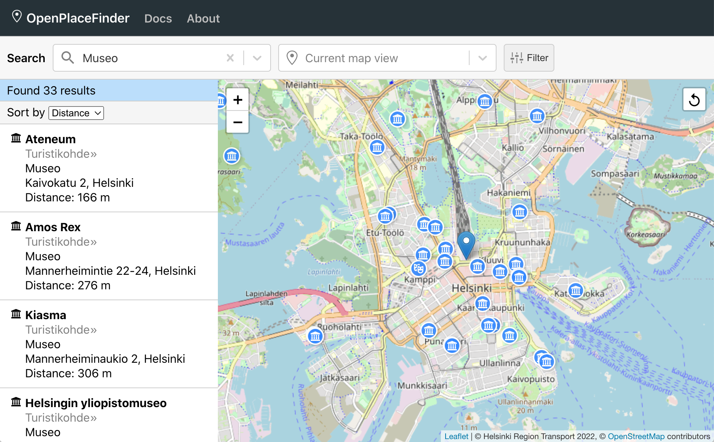

# OpenPlaceFinder

OpenPlaceFinder is a web application which helps users discover various points of interest in the OpenStreetMap database. It supports a streamlined form of *place search*, also known as a point of interest (POI) search. It allows you to specify what you are looking for, and where, and quickly produces a map of matching places.

You can use this service online at [openplacefinder.org](https://openplacefinder.org/). For the best user experience, we recommend the desktop versio of Chrome, but you should be able to use the site with a recent desktop version of any major browser.

## Documentation

We have prepared documentation to help you get up to speed:

* **User Guide.** We have a [user guide](docs/guide.md) which should help you get started. If you still run into problems, you can [open an issue](https://github.com/mriekkinen/openplacefinder/issues) on this repository.
* **Installation and Development.** If you would like to contribute to development, you can follow the instructions at [installation and development](docs/development.md).

## Acknowledgements

Several remarkable projects enable this app and many others. The following software, data and services power this app:

- **OpenStreetMap.** This app is based on the [OpenStreetMap](https://www.openstreetmap.org/) geographic database, without which this app wouldn't exist. We also download map tiles from their public servers.
- **Overpass API**. We use the [Overpass API](https://overpass-api.de/) to filter OpenStreetMap data, and show only relevant points of interest. As a server, we use a public instance provided by [Kumi Systems](https://overpass.kumi.systems/).
- **Pelias Geocoder**. We use [Pelias](https://pelias.io/) to translate place names and addresses into geographical coordinates. As a server, we use a public instance provided by [Helsinki Region Transport](https://digitransit.fi/en/developers/apis/).
- **iD Tagging Schema**. A collection of *presets*, which encode tagging conventions into a collection of feature types (see [schema](https://github.com/ideditor/schema-builder) and [data](https://github.com/openstreetmap/id-tagging-schema)). We use these to power search and classify elements on the ground.
- **Leaflet**. [Leaflet](https://leafletjs.com/) powers the interactive map user interface, also known as a "slippy map".

Beyond these, we use [React](https://reactjs.org/) on the front-end and [Node.js](https://nodejs.org/)/[Express](https://expressjs.com/) on the back-end. Both are written in [TypeScript](https://www.typescriptlang.org/).

## Similar projects

If you are not familiar with the OpenStreetMap ecosystem, we encourage you to try [Overpass turbo](https://overpass-turbo.eu). This project has similarities with Overpass turbo, but is directed towards more casual users. Overpass turbo provides an interface based on the Overpass Query Language and is hence directed towards more advanced use cases.

## License

[MIT](LICENSE)
