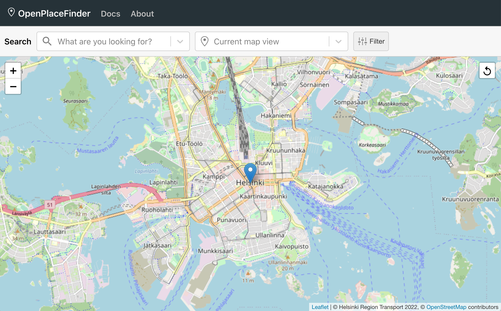
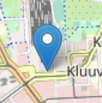
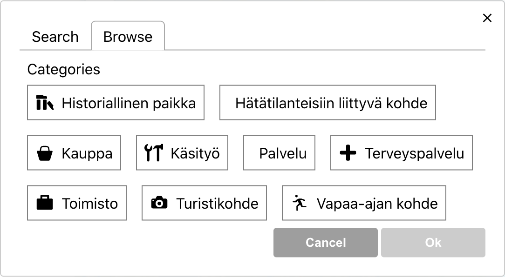
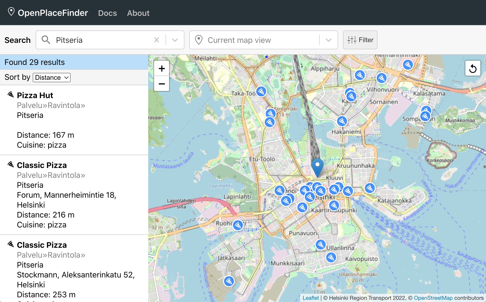

# OpenPlaceFinder User Guide

## Introduction

In this guide you'll learn how to use OpenPlaceFinder. Hopefully, you'll find most of the functionality pretty intuitive, based on previous knowledge from similar systems. However, we'll start with the basics, while trying to present a bit of context and a few useful hints along the way.

**TLDR:** If you just want to get up to speed as quickly as possible, take a look at the [examples](#examples) at the end.

OpenPlaceFinder is a web application, which can be used to locate places based on their type and geographical location. For instance, we could look for restaurants in the vicinity of our homes. If there are many such restaurants, we can narrow down the search using, for instance, the type of food they serve. This type of search is known as a *place search*, also known in mapping lingo as a point of interest (POI) search.

With this tool it is possible to answer questions like

1. What pizzerias are there in this area?
2. What is the closest supermarket relative to my location?

These particular examples might be important, for instance, when travelling or comparing new apartments.

OpenPlaceFinder is based on [OpenStreetMap](https://www.openstreetmap.org), which is an open geographic database maintained by volunteers. In order to make queries to this data, we use the [Overpass API](https://overpass-api.de), which provides powerful filters for the OpenStreetMap dataset. You don't have to be familiar with these services, but it's nice to know that, while you use this site, it communicates with external servers to download map tiles and query points of interest.

One feature inherited from OpenStreetMap is that we don't present reviews. For instance, in the case of restaurants, you can't search or sort based on a restaurant's average customer rating. This is based on OpenStreetMap's policy of not including subjective experiences into the database. Since this application is open source, we made the choice of not using data from separate review platforms which are mostly proprietary.

## Supported browsers and limitations

This app has been designed for desktop browsers. You should use a desktop browser, since the layout doesn't scale well to smaller mobile screens. For the best user experience, we recommend using Chrome. The site has been developed using Chrome, so you might see slight differences with other browsers. The primary concern is that other browsers haven't received that much testing.

We should warn you that, at this time, the app is Finland-centric. **Some of the data is presented in Finnish, and you are mostly limited to searching Finnish locations.** The former can be addressed, buth the latter is a consequence of the size of full planet builds. That simply makes it more expensive to host a service with a global coverage.

## Getting started

Once you open the site [openplacefinder.org](https://openplacefinder.org) in your browser, you'll be greeted with a view similar to what you can see below. You should see a map display with some controls, and another set of controls above the map. We'll discuss the specifics of these in the following sections.

## Specifying your location

First, you should select your location of interest. This could be, for instance, your home or workplace, or it could be a place where you are headed. You start by typing a place name, such as a street address, into the box which says *Current map view*. You may also enter the name of a building, such as a shopping mall. As you type, the box presents suggestions, and once you see the one that fits you should select it. This will center the map to that location.

Second, you should specify a suitable search radius around your location. As you may have guessed, the search area is defined by the boundaries of the current viewport. In other words, the search is limited to the area you see on the screen (at the time of initiating the search). Hence, you adjust the search area simply by zooming in/out and panning.

If you prefer, you may also enter the name of a wider area. One piece of advice is that **if you are typing the name of a municipality, you should try to enter it's name twice**, for instance "Kuopio, Kuopio". This helps to disambiguate your search from other places containing the word Kuopio, such as "Kuopiontie" or "Ikea Kuopio". In this case, you can update your location by right-clicking on the map and selecting *Set location*.

If you are concerned about the privacy implications of sharing your location, we would like to reassure you that your location will only be used locally, within your browser, to compute distances to points of interest. The author of this app has no way of knowing your precise location. However, the queries you make, including the boundaries of the search area, will appear in the server logs. These logs are not actively monitored, but they exist in case of abuse. Also, the autocomplete element (*Current map view*) is connected to an external API and they might log the street addresses you provide as input.

Your location is indicated by a big blue marker.

If you wish to repeat a search using the current viewport, you may click the *Search in this area* button, which is located on the top-right corner of the map. This initiates a new search using the current settings.

## Specifying the type of places to search for

This app searches for places by their type. You specify a category, such as "restaurants" or "museums", and the app lists all places of that type in the search area.

In order to search for features of a given type, we simply type the name of that category into the search box labeled *What are you looking for?* For instance, if we are looking for museums, we type "museo" into the search box. While we type the systems displays suggestions which provide clues into the available options.

An alternative technique is to open the drop-down menu and click *select from a list*. This opens a modal, seen below, which lists the hierarchy of supported categories. You can navigate the hierarchy by clicking on individual labels.

Nevertheless, each category is known by one unique name. To make things a little easier, for many features the system recognizes a few alternative terms. Regardless, in some cases, guessing the name used by the system can be challenging. Usually there are good reasons for a choice but, to a degree, it is a matter of convention agreed upon by the OpenStreetMap community.

A few examples of convention include

- Small shops that sell mainly food items are tagged [convenience stores](https://wiki.openstreetmap.org/wiki/Tag:shop%3Dconvenience) while large shops are tagged as [supermarkets](https://wiki.openstreetmap.org/wiki/Tag:shop%3Dsupermarket). In Finnish these are called "lähikauppa" and "supermarketti".
- Places selling [fast food](https://wiki.openstreetmap.org/wiki/Tag:amenity%3Dfast_food) are tagged as such, while [restaurants](https://wiki.openstreetmap.org/wiki/Tag:amenity%3Drestaurant) are more formal establishments. In Finnish these are called "pikaruokaravintola" and "ravintola".

The page [Map features](http://wiki.openstreetmap.org/wiki/Map_features) in the OpenStreetMap wiki details these and many other conventions. However, be warned, that given the wide scope of OpenStreetMap, the list of map features is extensive.

## Filtering

When searching for common places in a densely populated area, the number of results may become overwhelming. To manage this, the app provides filters which allow us to focus our attention to the most relevant places.

Results can be filtered by name, opening hours and category:

- **Name.** This is the name of a place, as displayed e.g. on signs on the ground. Since the name of a place often includes a brand name, the name field allows us to filter by brand, as well.
- **Opening hours.** Allows us to view places which are open at the moment. However, please note that this filter excludes places for which the opening hours haven't been listed in the database. The listed opening hours might also become out-of-date.
- **(Sub)categories.** Allows us to narrow down the search to one or more categories. Usually these are subcategories of the principal category. For instance, we might search for restaurants, but then, upon inspecting the results, decide to narrow down the search to just pizzerias.

By default, the results are sorted by distance from the user's location. If the top results seem surprising, you may wish to check your location setting. As we recall, user's location is indicated by a big blue marker and can be updated by right-clicking on the map.

In the process of filtering and inspecting the results, you may find that some information you need is missing or incomplete. This is unavoidable, but since OpenStreetMap is a collaborative effort you may, if you are interested, consider [contributing a fix](https://wiki.openstreetmap.org/wiki/Beginners%27_guide).

## Examples

### Example 1a. Pizzerias in downtown Helsinki

Our first example involves finding a good place for dinner. In this case, we've decided on having a good pizza in the downtown area.

As noted earlier, OpenStreetMap distinguishes between restaurants and fast-food restaurants. Hence, you can find pizza places under both categories (called "pitseria" and "pitseria-pikaruokaravintola"). In this case, we'll search only for the former.

The basic workflow is as follows:

* Enter your location. We typed "Helsingin päärautatieasema".
* Choose a place category. We typed "pitseria".
* Browse the results. Our search returned 29 restaurants.

You can see the results for our search below.

Next, we would like to dig a little deeper.

Suppose we have identified a few promising chains. For the sake of argument, let's assume that they are Classic Pizza and Kotipizza. We would like to filter by brand to show only restaurants belonging to one of these chains. By opening the filter panel, we'll see that there's a name field, which can serve as a proxy for the brand filter. If we use "classic" and "kotipizza" as name filters (one at a time), we'll discover that both have 2 restaurants in our search area.

It's time to decide. We observe that the closest Classic Pizza is only 216 meters away while the closest Kotipizza is around 600 meters away. Since both are open for business, depending on our preferences, we might choose either one.

### ---

* [Pizzerias in downtown Helsinki](https://openplacefinder.org/?q=amenity.restaurant.pizza&loc=60.1706_24.9415&map=13_60.1667_24.9420)
* [Supermarkets in downtown Helsinki](https://openplacefinder.org/?q=shop.supermarket&loc=60.1706_24.9415&map=13_60.1667_24.9420) and, for comparison, [convenience stores in the same area](https://openplacefinder.org/?q=shop.convenience&loc=60.1706_24.9415&map=13_60.1667_24.9420)
* [All shops in the Sello shopping centre](https://openplacefinder.org/?q=shop&loc=60.2181_24.8122&map=17_60.2181_24.8111)
