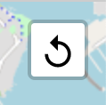

# OpenPlaceFinder User Guide

## Introduction

In this guide you'll learn how to use OpenPlaceFinder. Hopefully, you'll find most of the functionality pretty intuitive, based on previous knowledge from similar systems. However, we'll start with the basics, while trying to present a bit of context and a few more advanced hints along the way.

OpenPlaceFinder is a web application, which can be used to locate places based on their type and geographical location. For instance, we could look for restaurants in the vicinity of our homes. If there are many such restaurants, we can narrow down the search using, for instance, the type of food they serve. This type of search is known as a *place search*, also known in mapping lingo as a point of interest (POI) search.

OpenPlaceFinder is based on [OpenStreetMap](https://www.openstreetmap.org), which is an open geographic database powered by volunteers. In order to make queries to this data, we use the [Overpass API](https://overpass-api.de), which is a search engine for the OpenStreetMap dataset. You don't have to be familiar with these services, but it's nice to know that, while you use this site, it communicates with OpenStreetMap servers to download map tiles and query points of interest.

One feature inherited from OpenStreetMap is that we don't present reviews. For instance, in the case of restaurants, you can't search or sort based on a restaurant's average customer rating. This is based on OpenStreetMap's policy of not including subjective experiences into the database. Since this application is open source, we made the choice of not using data from separate review platforms which are mostly proprietary.

## Browser support (and other limitations)

This is a desktop app, so you should use a desktop browser. You might be able to use a tablet, but the layout doesn't scale well to smaller mobile screens.

If you want to be safe, we recommend using Chrome. The site has been developed using Chrome, so you might see slight differences with other browsers. The primary concern is that other browsers haven't received much testing (if any), but that's something we hope to address in the near future.

We should warn you that, at this time, the app is Finn-centric. **Some of the data is presented in Finnish, and you are mostly limited to searching Finnish locations.** The former can be addressed, buth the latter is a consequence of the size of full planet builds. That simply makes it more expensive to host a service with a global coverage.

## Getting started

Once you open the site [openplacefinder.org](https://openplacefinder.org) in your browser, you'll be greeted with a view similar to what you can see below. You should see a map display with some controls, and another set of controls above the map. We'll discuss the specifics of these in the following sections.

## Area selection

First, you should select your search area. This could be, for instance, an area surrounding your home or workplace, or it could be an area where you are headed. You start by typing a place name, such as a street address or the name of a municipality, into the box which says *Current map view*. As you type, the box presents suggestions, and once you see the one that fits you should select it. This will center the map to that location.

If you are typing the name of a municipality, you should try to enter it's name twice, for instance *Kuopio, Kuopio*. This helps to disambiguate your search from other places containing the word Kuopio, such as "Kuopiontie" or "Ikea Kuopio". In the image below, we can see that if we enter the name twice, the city of Kuopio is second from the top.

As you may have guessed, the search area is defined by the boundaries of the current viewport. In other words, the search is limited to the area you see on the screen (at the time of initiating the search). If you wish to repeat a search using the current viewport, you may click the *Search in this area* button, which is located on the top-right corner of the map. This initiates a new search using the current settings.

## Feature type selection

...

For now, let's assume that we are back in Helsinki and looking for museums in the city centre.

## Sorting and filtering

// Todo: My location (blue marker)

...

